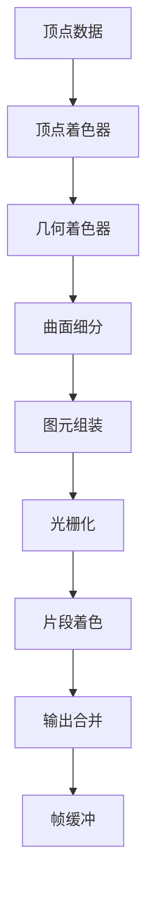

# 游戏图形渲染技术

## 渲染管线

### 渲染流程图



### 顶点处理阶段

| 阶段 | 功能 | 输入 | 输出 |
|-----|------|------|------|
| 顶点着色器 | 顶点变换 | 顶点坐标 | 裁剪空间坐标 |
| 几何着色器 | 图元修改 | 图元 | 新图元 |
| 曲面细分 | 细分图元 | 补丁 | 更多顶点 |
| 顶点变换 | 坐标变换 | 顶点 | 屏幕坐标 |

**顶点着色器示例**：

```glsl
#version 330 core

layout(location = 0) in vec3 aPos;
layout(location = 1) in vec3 aNormal;
layout(location = 2) in vec2 aTexCoord;

out vec3 FragPos;
out vec3 Normal;
out vec2 TexCoord;

uniform mat4 model;
uniform mat4 view;
uniform mat4 projection;

void main()
{
    FragPos = vec3(model * vec4(aPos, 1.0));
    Normal = mat3(transpose(inverse(model))) * aNormal;
    TexCoord = aTexCoord;
    
    gl_Position = projection * view * vec4(FragPos, 1.0);
}
```

### 光栅化阶段

```c++
// 光栅化伪代码
void Rasterizer::rasterizeTriangle(const Triangle& tri) {
    // 1. 边界框计算
    BoundingBox bbox = calculateBoundingBox(tri);
    
    // 2. 遍历像素
    for (int y = bbox.min.y; y <= bbox.max.y; y++) {
        for (int x = bbox.min.x; x <= bbox.max.x; x++) {
            // 3. 重心坐标测试
            vec3 barycentric = calculateBarycentric(x, y, tri);
            
            if (isInsideTriangle(barycentric)) {
                // 4. 深度测试
                float depth = interpolateDepth(barycentric, tri);
                
                if (depthTest(x, y, depth)) {
                    // 5. 片段着色
                    Fragment frag = interpolateFragment(barycentric, tri);
                    fragmentShader(frag);
                    
                    // 6. 写入帧缓冲
                    frameBuffer.setPixel(x, y, frag.color);
                    depthBuffer.setDepth(x, y, depth);
                }
            }
        }
    }
}
```

## 图形API对比

### OpenGL

**优势**：
- 跨平台支持
- 丰富的文档和社区
- 状态机模型简单易懂

**劣势**：
- 性能相对较低
- 不支持多线程

### DirectX

**优势**：
- Windows平台性能优秀
- 硬件厂商优化好
- HLSL着色器语言强大

**劣势**：
- 仅限Windows平台
- 学习曲线较陡

### Vulkan

**优势**：
- 低开销，高性能
- 多线程支持
- 显式控制，灵活强大

**劣势**：
- 开发复杂度高
- 需要更多代码

<details>
<summary>点击查看详细对比表格</summary>

| 特性 | OpenGL | DirectX 12 | Vulkan |
|-----|--------|-----------|--------|
| 性能 | ⭐⭐⭐ | ⭐⭐⭐⭐ | ⭐⭐⭐⭐⭐ |
| 跨平台 | ✅ | ❌ | ✅ |
| 多线程 | ❌ | ✅ | ✅ |
| 易用性 | ⭐⭐⭐⭐⭐ | ⭐⭐⭐ | ⭐⭐ |
| 社区支持 | ⭐⭐⭐⭐⭐ | ⭐⭐⭐⭐ | ⭐⭐⭐ |
</details>

## 渲染技术

### 实时渲染流程

```
场景图 → 可见性剔除 → 排序 → 渲染 → 后处理
```

### 延迟渲染

> 延迟渲染将光照计算推迟到几何阶段之后，可以处理大量光源。

### 前向渲染

- 简单直接
- 适合少量光源
- 透明物体处理方便

### 光线追踪

```cpp
// 简单的光线追踪实现
vec3 traceRay(Ray ray, int maxBounces) {
    vec3 color = vec3(0.0);
    vec3 throughput = vec3(1.0);
    
    for (int i = 0; i < maxBounces; i++) {
        Hit hit = scene.intersect(ray);
        
        if (hit.t < INFINITY) {
            // 计算光照
            color += throughput * computeLighting(hit);
            
            // 生成反射光线
            ray = generateReflectionRay(hit);
            throughput *= hit.material.reflectance;
        } else {
            color += throughput * backgroundColor;
            break;
        }
    }
    
    return color;
}
```

## 参考资料

- [Learn OpenGL](https://learnopengl.com/)
- [Vulkan Tutorial](https://vulkan-tutorial.com/)
- [Real-Time Rendering](https://www.realtimerendering.com/)

---

**文档结束** 🎮
