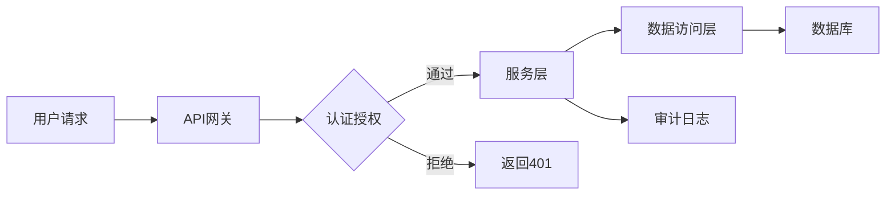

# 技术架构设计

## 分布式系统设计

### 架构模式对比

```
单体架构 → SOA架构 → 微服务架构 → Serverless
```

| 模式 | 优点 | 缺点 | 适用场景 |
|-----|------|------|---------|
| 微服务 | 独立部署、技术栈灵活 | 复杂度高、运维成本大 | 大型系统 |
| 事件驱动 | 松耦合、异步处理 | 调试困难、最终一致性 | 高并发场景 |
| CQRS | 读写分离、性能优化 | 复杂度增加 | 读写差异大 |
| 六边形 | 测试友好、依赖倒置 | 学习曲线陡 | DDD项目 |

### 设计原则

1. **单一职责原则** (SRP)
   > 一个类应该只有一个引起它变化的原因。

2. **开闭原则** (OCP)
   > 软件实体应该对扩展开放，对修改关闭。

3. **依赖倒置原则** (DIP)
   > 高层模块不应该依赖低层模块，两者都应该依赖抽象。

```typescript
// 依赖倒置示例
interface MessageService {
  send(message: string): Promise<void>;
}

class EmailService implements MessageService {
  async send(message: string): Promise<void> {
    // 发送邮件实现
  }
}

class NotificationService {
  constructor(private messageService: MessageService) {}
  
  async notify(message: string): Promise<void> {
    await this.messageService.send(message);
  }
}

// 使用依赖注入
const emailService = new EmailService();
const notification = new NotificationService(emailService);
```

## 安全与隐私

### 安全机制架构



### 安全检查清单

- [x] 身份认证
- [x] 权限控制
- [x] 数据加密（传输中）
- [x] 数据加密（存储中）
- [x] SQL注入防护
- [x] XSS防护
- [x] CSRF防护
- [ ] API限流
- [ ] 敏感数据脱敏

### 加密算法选择

| 数据类型 | 加密算法 | 密钥长度 | 性能 |
|---------|---------|---------|------|
| 传输加密 | TLS 1.3 | 256位 | 高 |
| 存储加密 | AES-256 | 256位 | 高 |
| 密码存储 | Argon2 | - | 中 |
| 签名验证 | ECDSA | 256位 | 中 |

```go
// 加密工具类示例
package security

import (
    "crypto/aes"
    "crypto/cipher"
    "crypto/rand"
    "io"
)

type Encryptor struct {
    key []byte
}

func NewEncryptor(key string) *Encryptor {
    return &Encryptor{key: []byte(key)}
}

func (e *Encryptor) Encrypt(plaintext []byte) ([]byte, error) {
    block, err := aes.NewCipher(e.key)
    if err != nil {
        return nil, err
    }
    
    gcm, err := cipher.NewGCM(block)
    if err != nil {
        return nil, err
    }
    
    nonce := make([]byte, gcm.NonceSize())
    if _, err = io.ReadFull(rand.Reader, nonce); err != nil {
        return nil, err
    }
    
    ciphertext := gcm.Seal(nonce, nonce, plaintext, nil)
    return ciphertext, nil
}

func (e *Encryptor) Decrypt(ciphertext []byte) ([]byte, error) {
    block, err := aes.NewCipher(e.key)
    if err != nil {
        return nil, err
    }
    
    gcm, err := cipher.NewGCM(block)
    if err != nil {
        return nil, err
    }
    
    nonceSize := gcm.NonceSize()
    if len(ciphertext) < nonceSize {
        return nil, errors.New("ciphertext too short")
    }
    
    nonce, ciphertext := ciphertext[:nonceSize], ciphertext[nonceSize:]
    plaintext, err := gcm.Open(nil, nonce, ciphertext, nil)
    if err != nil {
        return nil, err
    }
    
    return plaintext, nil
}
```

## 弹性伸缩

### 自动扩展策略

```yaml
# Kubernetes HPA配置
apiVersion: autoscaling/v2
kind: HorizontalPodAutoscaler
metadata:
  name: app-hpa
spec:
  scaleTargetRef:
    apiVersion: apps/v1
    kind: Deployment
    name: app-deployment
  minReplicas: 2
  maxReplicas: 10
  metrics:
  - type: Resource
    resource:
      name: cpu
      target:
        type: Utilization
        averageUtilization: 70
  - type: Resource
    resource:
      name: memory
      target:
        type: Utilization
        averageUtilization: 80
  behavior:
    scaleUp:
      stabilizationWindowSeconds: 60
      policies:
      - type: Percent
        value: 50
        periodSeconds: 60
    scaleDown:
      stabilizationWindowSeconds: 300
      policies:
      - type: Percent
        value: 10
        periodSeconds: 60
```

### 高可用性模式

<details>
<summary>故障转移机制</summary>

```python
class FailoverManager:
    def __init__(self, servers):
        self.servers = servers
        self.current_index = 0
        self.health_checks = {}
        
    def get_active_server(self):
        """获取可用的服务器"""
        for i in range(len(self.servers)):
            index = (self.current_index + i) % len(self.servers)
            if self.is_healthy(index):
                self.current_index = index
                return self.servers[index]
        raise Exception("No healthy servers available")
    
    def is_healthy(self, index):
        """检查服务器健康状态"""
        server = self.servers[index]
        try:
            response = requests.get(
                f"http://{server}/health",
                timeout=2
            )
            return response.status_code == 200
        except:
            return False
    
    def handle_failure(self, failed_server):
        """处理服务器故障"""
        print(f"Server {failed_server} failed, switching to next server")
        # 触发告警
        self.alert_failure(failed_server)
        # 自动切换
        self.get_active_server()
```

</details>

## 性能优化

### 缓存策略

```
L1缓存 → L2缓存 → L3缓存 → RAM → 磁盘
```

| 缓存类型 | 容量 | 延迟 | 用途 |
|---------|------|------|------|
| 内存缓存 | 1-10GB | <1ms | 热点数据 |
| Redis | 10-100GB | 1-5ms | 共享缓存 |
| CDN | TB级 | 10-100ms | 静态资源 |
| 数据库缓存 | 取决于配置 | 10-100ms | 查询结果 |

### 数据库优化

```sql
-- 索引优化示例
CREATE INDEX idx_user_email ON users(email);
CREATE INDEX idx_order_created_at ON orders(created_at DESC);

-- 复合索引
CREATE INDEX idx_order_user_status 
ON orders(user_id, status, created_at);

-- 覆盖索引
CREATE INDEX idx_order_cover 
ON orders(user_id, status) 
INCLUDE (amount, created_at);

-- 分区表
CREATE TABLE orders (
    id BIGINT,
    user_id BIGINT,
    amount DECIMAL(10,2),
    created_at TIMESTAMP,
    status VARCHAR(20)
) PARTITION BY RANGE (YEAR(created_at)) (
    PARTITION p2022 VALUES LESS THAN (2023),
    PARTITION p2023 VALUES LESS THAN (2024),
    PARTITION p2024 VALUES LESS THAN (2025),
    PARTITION pmax VALUES LESS THAN MAXVALUE
);
```

## 参考资料

- [微服务架构模式](https://microservices.io/patterns/)
- [云原生架构白皮书](https://www.cncf.io/)
- [系统设计面试](https://systemdesign.one/)

---

**文档结束** 🏗️
